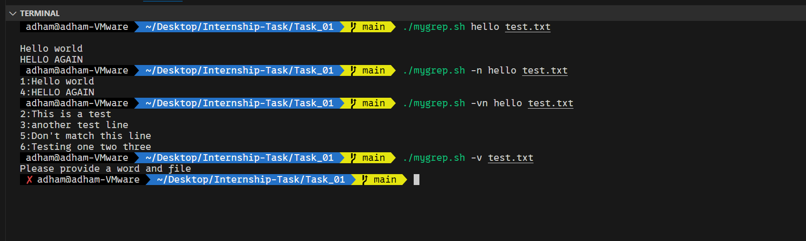
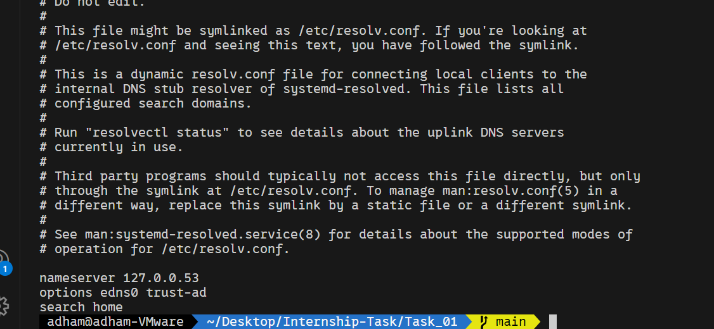

# Task_01 & Task_02

## Task_01

### Test Output for `mygrep` Script File


- The script begins by checking if `--help` is passed as the first argument. If so, it immediately prints the help message and exits.
- Then, it initializes two boolean variables to track whether the options `-n` and `-v` are triggered or not.
- After parsing the options, the script shifts the arguments to get the search string and the file name. It also validates that at least two parameters are provided and checks whether the file exists.

---

### Supporting Regex or `-i` / `-c` / `-l` Options
- To support additional options, I would add new cases in the `getopts` block to handle `-i`, `-c`, and `-l`.

---

### Hardest Part
- I think the hardest part was handling the options parsing.

---

## Task_02

1. First, we check the local DNS configuration to see which server is being used to resolve domain names:  
   ```bash
   cat /etc/resolv.conf
   ```
   

2. With the help of the `dig` command, we can check the DNS server response and the IP address for the domain name:  
   ```bash
   dig internal.example.com
   ```

3. Compare the results with a public DNS server:  
   ```bash
   dig internal.example.com @8.8.8.8
   ```
   - This domain should **not** be resolved by a public DNS server because it is an internal domain. If it resolves publicly, the risk is high, as internal domains should not be exposed to the public.

4. Test connectivity to the IP address using `ping`, `curl`, or `telnet` on multiple ports:
   ```bash
   curl -I http://internal.example.com:80
   curl -I http://internal.example.com:443
   telnet <ip> 80
   ```

---

### Possible Root Causes

1. **DNS Problems:**
   - DNS server is offline.
   - No DNS entry for `internal.example.com`.
   - Client is using the wrong DNS server.

2. **Firewall and Network Problems:**
   - Firewall is blocking the connection.
   - Web server is down.
   - Network routing issue — packets are not reaching the web server.

---

### How to Fix the Problem

1. Ping the DNS server IP to check if it is reachable.
2. Check the status of the DNS server:
   ```bash
   systemctl status dns-server
   ```
   - You can restart the DNS server 
   ```bash
   systemctl restart dns-server
   ```

---
### missing  record 

- check by type 
`dig internal.example.com@<dns-server-ip>`
- fix => 
```# Edit DNS zone file (example for BIND):
sudo nano /etc/bind/zones/internal.example.com.zone
# Add line: internal.example.com. IN A 192.168.1.100
sudo systemctl reload bind9
```
### firewall blocking ports 
`sudo ufw status`
- fix =>  all for both ports http and https
```bash
sudo ufw allow 80/tcp
sudo ufw allow 443/tcp
```

### make sure the web server is already listening on the specified ports 
```bash
ss -tuln | grep ':80\|:443'
```